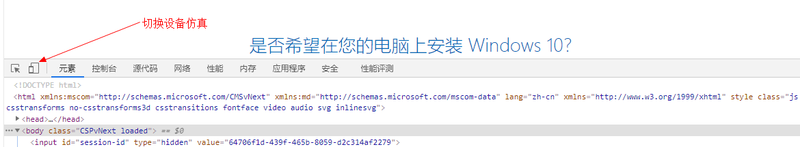
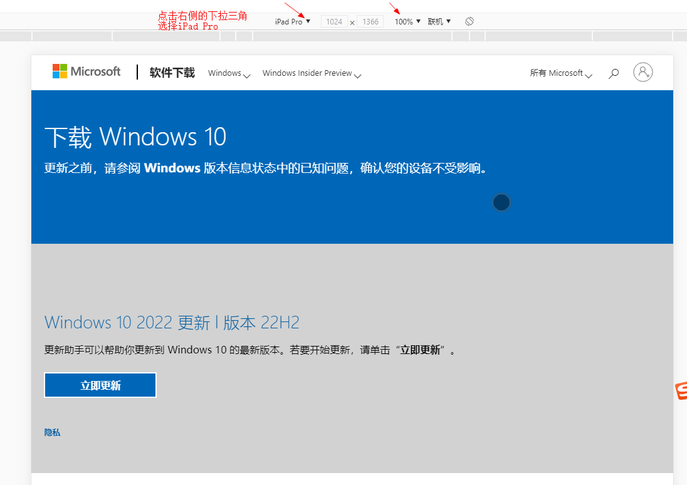
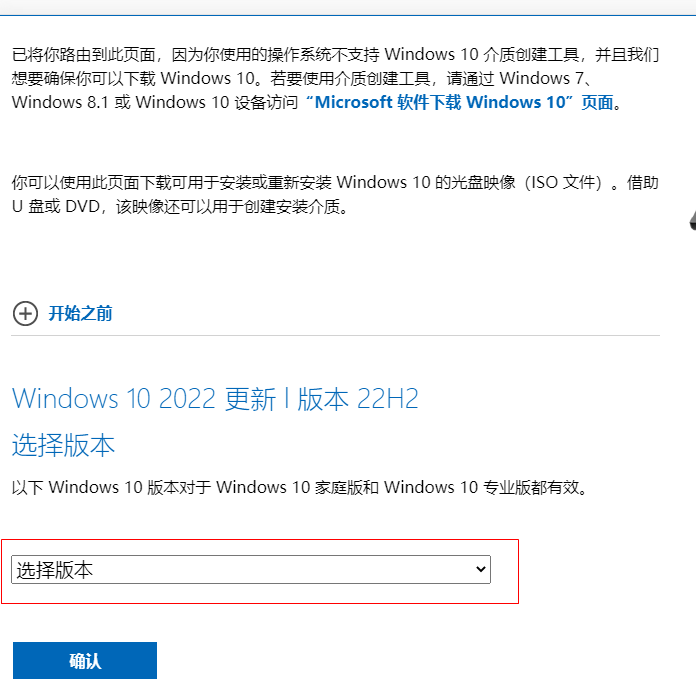
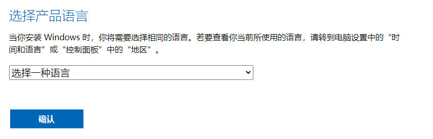
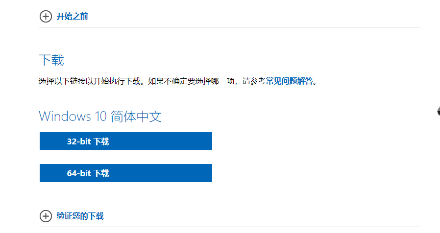

#### 在Mcirosoft官网下载原版Windows10系统

第一步，进入[微软官方网站](https://www.microsoft.com/zh-cn/software-download/windows10),界面里没有直接下载win10系统文件的按钮，简单设置一下，把隐藏的下载显示出来。

 第二步，F12调出浏览器开发者工具，点击左上角的“切换设备仿真”图标。(如果F12后，浏览器没有仿真界面，可以使用360浏览器试试)。

   

第三步，F5刷新一下，页面出现“选择版本”界面。

第四部，关闭F12打开的开发者窗口，选择要下载的“windows 10”，确认后在”语言选择“下拉列表中中选择""简体中文”,再选择合适的系统版本，可以直接下载，也可以复制下载链接在迅雷中下载。如下图所示：

