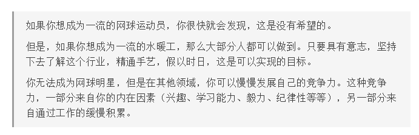

* 关于一个人本身的特质

  > 如果你想成为一流的网球运动员，你很快就会发现，这是没有希望的。
  >
  > 但是，如果你想成为一流的水暖工，那么大部分人都可以做到。只要具有意志，坚持下去了解这个行业，精通手艺，假以时日，这是可以实现的目标。
  >
  > 你无法成为网球明星，但是在其他领域，你可以慢慢发展自己的竞争力。这种竞争力，一部分来自你的内在因素（兴趣、学习能力、毅力、纪律性等等），另一部分来自通过工作的缓慢积累
  >
  > “快能力”更多地取决于天赋或外部条件，所以普通人不容易成功；“慢能力”则是取决于后天的努力，可以用时间来换。芒格建议，如果没有天赋，就尽量选择“慢能力”的行业，这样你才有机会通过日复一日的积累做到优秀。
  >
  > 我就想到了一个问题：程序员属于“快能力”，还是“慢能力”？
  >
  > 别的不敢说，前端开发大概是属于“快能力”。因为这个行业要求你快速形成生产力，根本没有时间积累，而且积累的效果不明显，因为开发工具变得太快。相比之下，C / C++ 语言应该属于“慢能力”，坚持写20年，会越写越好，但是前端不是这样，几年就换一套技术栈，代码的生命周期非常短。
  >
  > 所以，想要进入前端的同学，要有清醒的认识。优秀的前端程序员，其实比的是“冲刺能力”，你想一直在这个行业，就要一直在冲刺。“快能力”的行业都是如此，一段时间出不了成绩，就会被淘汰。如果你不适应这种生活，可能就需要做一些准备，想想能不能换到“慢能力”的行业。

